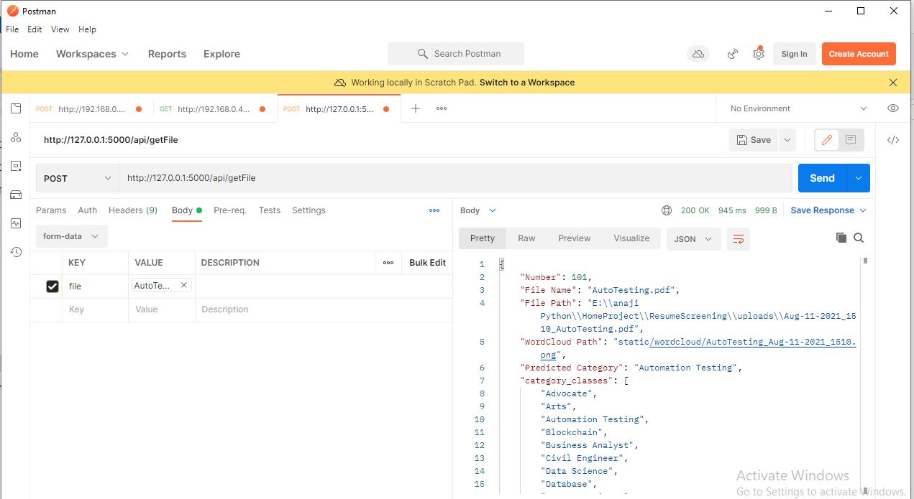

# Resume-Classifier
Resume Classifier using NLP and Machine Learning, Create Flask Application to predict Category given PDF resume file. 

## clone:
``` git clone https://github.com/anajikadam/Resume-Classifier.git ```

## create Virtual Environment:
In Anaconda Command Prompt

``` cd Resume-Classifier ```

``` python -m venv Venv```

``` Venv\Scripts\activate ```

``` pip install -r requirements.txt ```

## Run: 
``` python app.py ```
Flask Server Run on ``` http://127.0.0.1:5000/ ```
___________
### pdf Reader from Command Prompt and text file save in directory

___________
### train Model from Command Prompt

___________
### test Model from Command Prompt

___________
## Flask App Image for dir AppImages/


___________
## File upload from Postman and test api

___________
## Train Model From api url


__________
## Train Model on new data from api url
New data is text files which is store in predTextFile/ Folder which convert in dataframe and append to existing data and train again


## Dataset
Kaggle Dataset [Link](https://www.kaggle.com/gauravduttakiit/resume-dataset)

## Future work
Improve Model performance.
